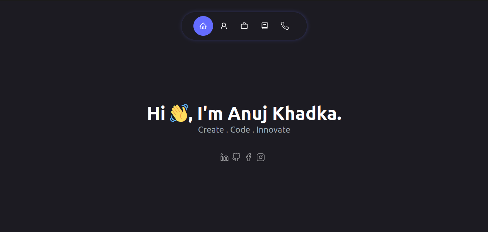
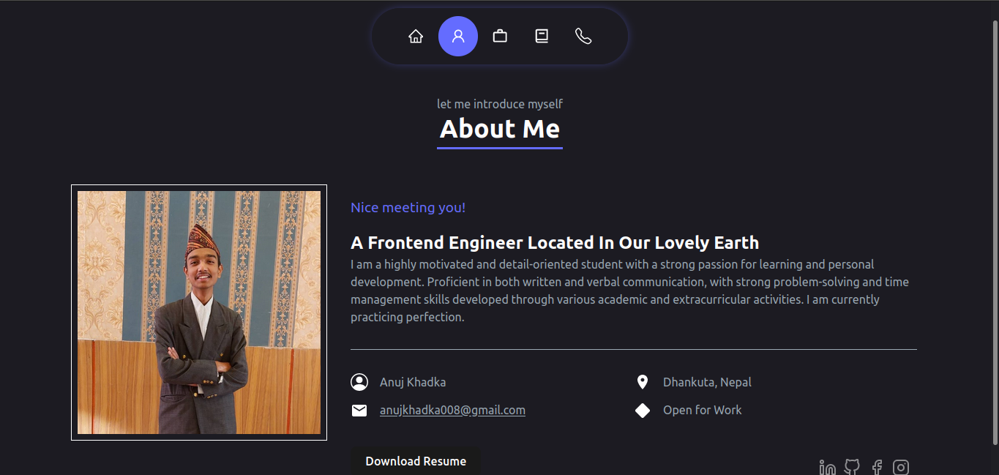
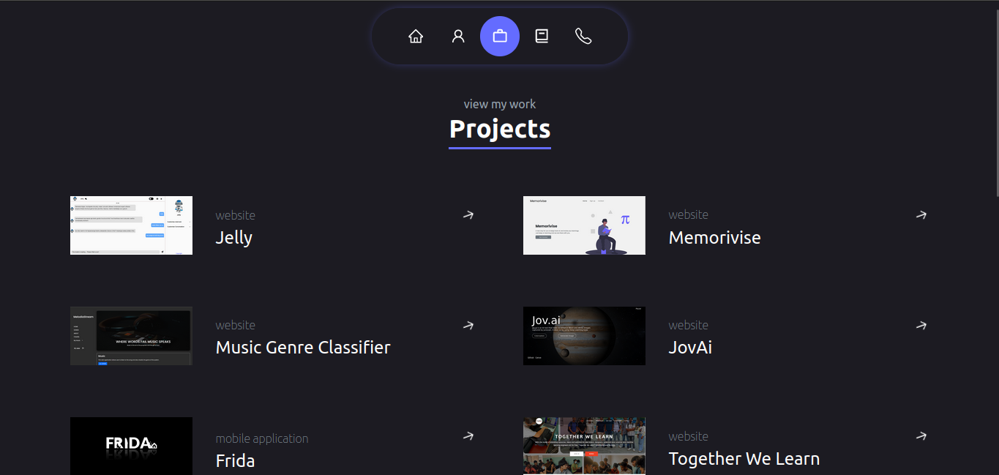
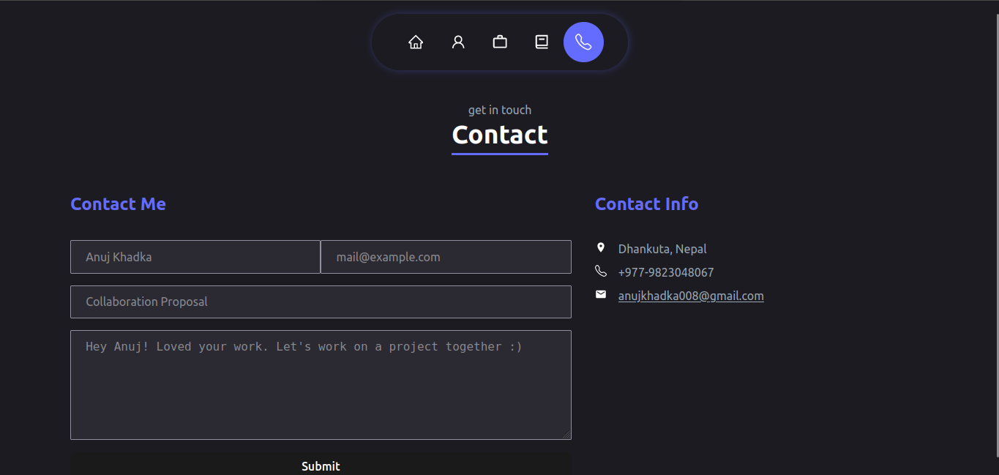

# Anujolio
> A portfolio website made with React js.


## Table of Content 
- [General Info](#general-info)
- [Technologies](#technologies)
- [Glimpse](#glimpse)
- [How to Run](#how-to-run)
    - [Live Demo](#live-demo)
    - [Run Locally](#run-locally)
- [Features](#features)
- [Other Details](#other-details)

## General Info
Introducing a sleek and modern portfolio site created using React.js. This dynamic website showcases a collection of works and achievements in an elegant and user-friendly manner. With seamless navigation and engaging design, it highlights skills, projects, and contact information, offering a professional platform to showcase talents and expertise.

## Glimpse
<p>
    
    
    
    
</p>

## How to Run
### Live Demo
Live demo at <a href="https://anujolio.netlify.app/" target="_blank">Anujolio</a>

### Run Locally
- Clone the reposiory in your local machine.
```bash
git clone https://github.com/Anuj-Khadka/mathify.git
```
- Open the terminal inside the project folder.
- Run the command
```bash
npm run dev
```
- Open the port in your browser `localhost:5173/` <br/>

# Features
- A clean and minimal home page
- About page with all the details about the presenter, and a well structured resume.
- Glimpse of projects
- Navigations and actions for project views.
